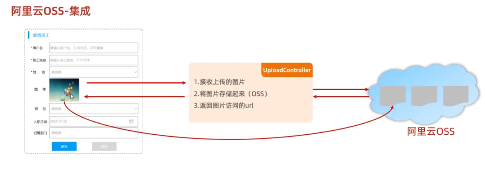
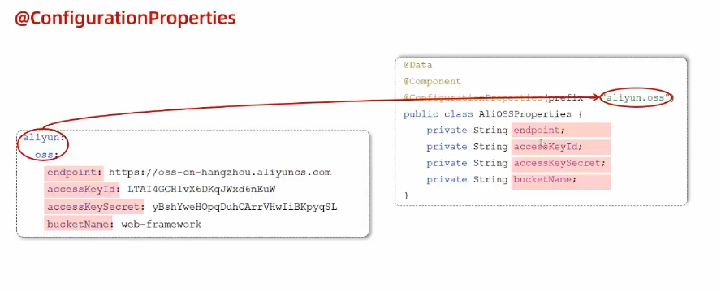
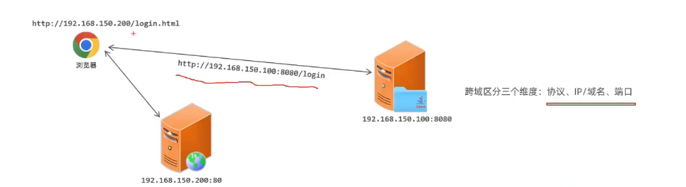
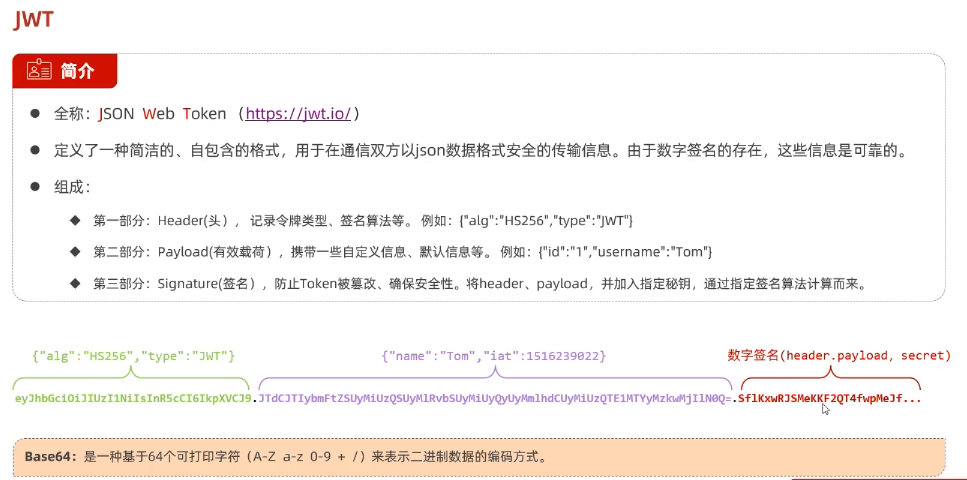

# 案例：tlias人事管理系统
使用到的技术：springboot mybatis mysql
## 1. 准备工作
### 1.1. 引入依赖
创建springboot工程，引入web,mybatis,mysql驱动，lombok依赖
### 1.2. 配置applications.properties
### 1.3. 准备对应的Mapper,Service,Controller
注意：有几个关键的注解，分别是：
1. controller -> @Controller
2. Service -> @Service (需要先创建接口，再创建实现类)
3. Mapper -> @Mapper (只创建接口)
4. pojo -> @Data @NoargsConstructor @AllArgsConstructor

最后，引入前后端交互统一响应结构 Result
### 1.4. 开发流程
1. 查看页面原型，明确需求
2. 阅读接口文档
3. 思路分析
4. 接口开发
5. 接口测试
6. 前后端联调

## 2. 部门管理
页面开发原则
1. 查询所有部门(部门较少，不考虑分页)
2. 新增部门
   1. 点击新增部门，会打开新增部门的页面
   2. 部门名称，必填，唯一，长度为2-10位
3. 删除部门
   1. 弹出确认框，删除成功后刷新页面
## 3. 员工管理
1. 分页查询
   2. 请求参数：页码，每页条数
   3. 响应结果：总条数，当前页数据
   4. 注解：@RequestParam(defaultValue = "1") Integer pageNum // 设置请求参数默认值
   5. 简化分页查询的方法：PageHelper.startPage(pageNum, pageSize);
      
2. 分页查询+条件查询
   1. 条件分页查询
      1. 条件查询：动态SQL->XML映射文件
      2. 分页查询：PageHelper.startPage(pageNum, pageSize);
3. 删除员工
4. 新增员工
## 4. 文件上传
文件上传的步骤(使用阿里云服务)：

1. 文件上传介绍
2. 前端页面三要素(file表单项、post方式、multipart/form-data)
3. 服务端接收文件
4. 文件存储方式
## 5. 修改员工
1. 通过查询员工信息，回显到修改页面
2. 修改员工信息
## 6. 配置文件
问题分析：
1. 项目中的配置信息，有些是固定的，有些是需要根据环境变化的
2. 使用yaml文件，可以显示树形结构，更加直观
使用@Value注解，虽然可以获取到配置文件中的值，但是不够灵活，不够方便

使用@ConfigurationProperties(prefix = "")注解，可以将配置文件中的值，一次性注入到实体类中
## 7. 登录功能
基础登录功能：使用Username和Password去数据库匹配对应的用户

但是，这样做有一个问题，就是用户没有登陆，直接访问这一个网址，还是可以访问到对应的页面，这是不合理的

所以，需要登录校验来防止这种操作
1. 通过统一拦截的方式，拦截所有请求
2. 通过登录标记的方式，判断用户是否登录
   1. 会话技术
      
      缺点：cookie不能跨域，移动端不支持cookie，不安全，用户可以禁用cookie
   
      Session是基于cookie的
      
      缺点：服务器集群环境下无法直接使用Session
   2. JWT令牌 ❤
      
      解决了上述缺点，但是缺点是需要自己实现 令牌存储在客户端，减轻服务器压力
   3. 过滤器Filter
   4. 拦截器Interceptor
