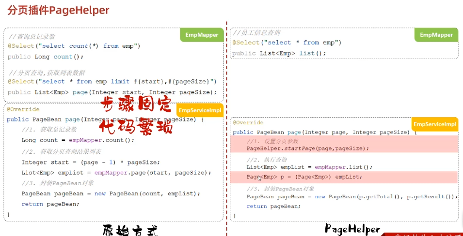

# 案例：tlias人事管理系统
使用到的技术：springboot mybatis mysql
## 1. 准备工作
### 1.1. 引入依赖
创建springboot工程，引入web,mybatis,mysql驱动，lombok依赖
### 1.2. 配置applications.properties
### 1.3. 准备对应的Mapper,Service,Controller
注意：有几个关键的注解，分别是：
1. controller -> @Controller
2. Service -> @Service (需要先创建接口，再创建实现类)
3. Mapper -> @Mapper (只创建接口)
4. pojo -> @Data @NoargsConstructor @AllArgsConstructor

最后，引入前后端交互统一响应结构 Result
### 1.4. 开发流程
1. 查看页面原型，明确需求
2. 阅读接口文档
3. 思路分析
4. 接口开发
5. 接口测试
6. 前后端联调

## 2. 部门管理
页面开发原则
1. 查询所有部门(部门较少，不考虑分页)
2. 新增部门
   1. 点击新增部门，会打开新增部门的页面
   2. 部门名称，必填，唯一，长度为2-10位
3. 删除部门
   1. 弹出确认框，删除成功后刷新页面
## 3. 员工管理
1. 分页查询
   2. 请求参数：页码，每页条数
   3. 响应结果：总条数，当前页数据
   4. 注解：@RequestParam(defaultValue = "1") Integer pageNum // 设置请求参数默认值
   5. 简化分页查询的方法：PageHelper.startPage(pageNum, pageSize);

2. 分页查询+条件查询
   1. 条件分页查询
      1. 条件查询：动态SQL->XML映射文件
      2. 分页查询：PageHelper.startPage(pageNum, pageSize);
3. 删除员工